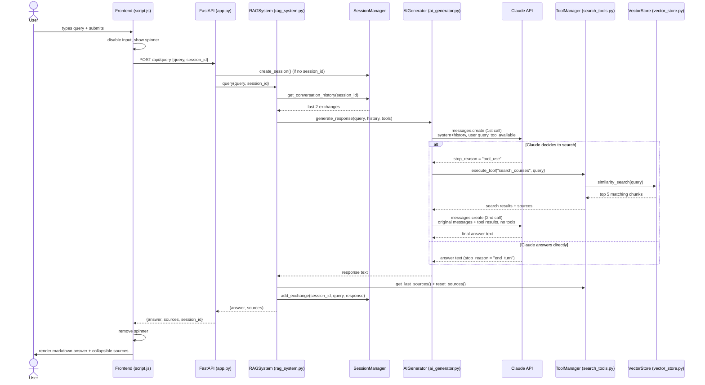

```mermaid
sequenceDiagram
    actor User
    participant FE as Frontend (script.js)
    participant API as FastAPI (app.py)
    participant RAG as RAGSystem (rag_system.py)
    participant SM as SessionManager
    participant AI as AIGenerator (ai_generator.py)
    participant Claude as Claude API
    participant TM as ToolManager (search_tools.py)
    participant VS as VectorStore (vector_store.py)

    User->>FE: types query + submits
    FE->>FE: disable input, show spinner
    FE->>API: POST /api/query {query, session_id}

    API->>SM: create_session() (if no session_id)
    API->>RAG: query(query, session_id)

    RAG->>SM: get_conversation_history(session_id)
    SM-->>RAG: last 2 exchanges

    RAG->>AI: generate_response(query, history, tools)

    AI->>Claude: messages.create (1st call)<br/>system+history, user query, tool available
    
    alt Claude decides to search
        Claude-->>AI: stop_reason = "tool_use"
        AI->>TM: execute_tool("search_courses", query)
        TM->>VS: similarity_search(query)
        VS-->>TM: top 5 matching chunks
        TM-->>AI: search results + sources
        AI->>Claude: messages.create (2nd call)<br/>original messages + tool results, no tools
        Claude-->>AI: final answer text
    else Claude answers directly
        Claude-->>AI: answer text (stop_reason = "end_turn")
    end

    AI-->>RAG: response text
    RAG->>TM: get_last_sources() + reset_sources()
    RAG->>SM: add_exchange(session_id, query, response)
    RAG-->>API: (answer, sources)

    API-->>FE: {answer, sources, session_id}
    FE->>FE: remove spinner
    FE->>User: render markdown answer + collapsible sources

```